# 住所を販売するECサイト
このプログラムは、住所を販売するECサイトである。もちろん、実際に販売しているのではなく架空である。

このECサイトには約12万もの住所があり、それらから自分の好きな場所を選び購入することができる。また、検索機能もついているため12万件という膨大なデータから自分の目的にあったものを容易に見つけることができるのも特徴である。

※住所の値段はExcelでランダムに入力しています。おそらく、一等地でも100円とかのことがあります。

# Demo
### 1. サインアップ
まずは、サインアップを行いユーザーの登録を行う。（作成した管理者用アカウントでログインしても良い）

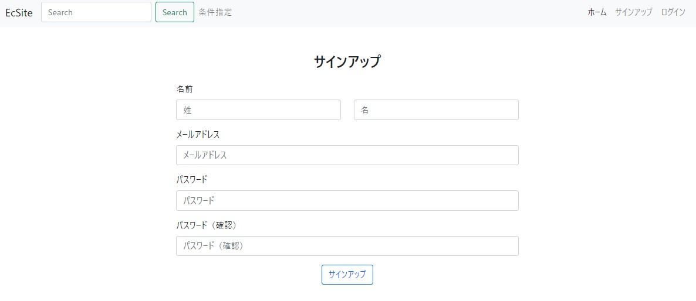

### 2. 商品選択
サインアップをすると商品一覧ページに遷移するので、自分の目的の商品を選ぶ。<br>
今回は、「沖縄」と検索し34万9748円の沖縄県那覇市赤嶺を選択する。

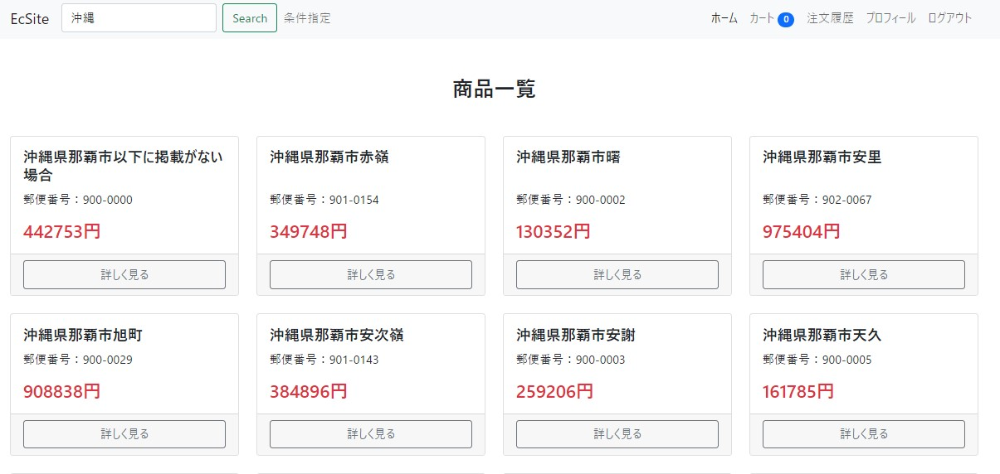

### 3. カートに入れる
商品をクリックすると、商品詳細画面に遷移する。<br>
このページの情報を確認し、在庫があればカートに入れることができる。<br>
「Google Mapで見る」をクリックすると、Google Mapが開きその住所の詳しい場所を見ることができる。

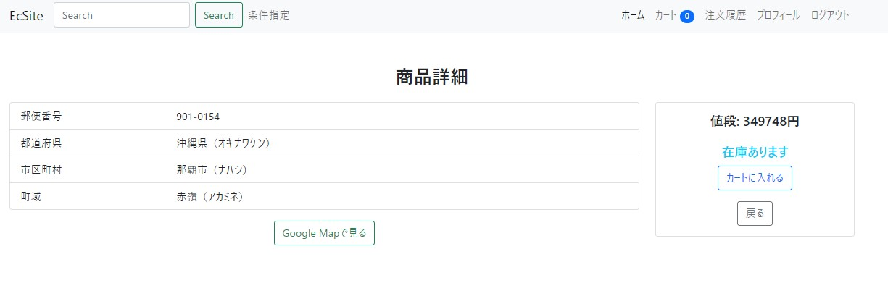

### 4. 購入する
商品をカートに入れるとショッピングカート画面に遷移する。ここで、「レジに進む」をクリックすると、購入内容確認画面に遷移し、お届け先と請求金額を確認することができる。<br>
「注文を確定する」を押すと、注文が確定される。

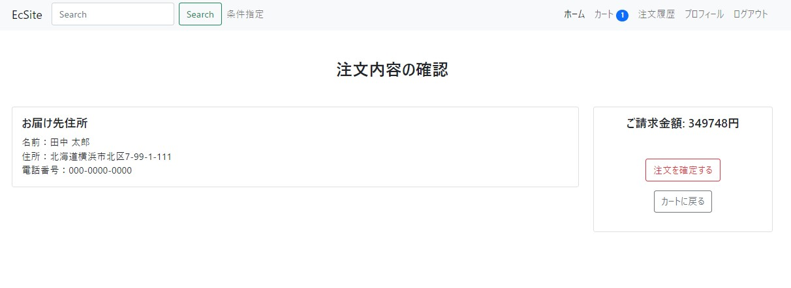

### 5. 注文履歴の確認
今までに注文した内容を確認することができる。

headerにある「注文履歴」をクリックすると、注文履歴ページに遷移する。<br>
このページでは、今までに注文した内容を確認することができる。

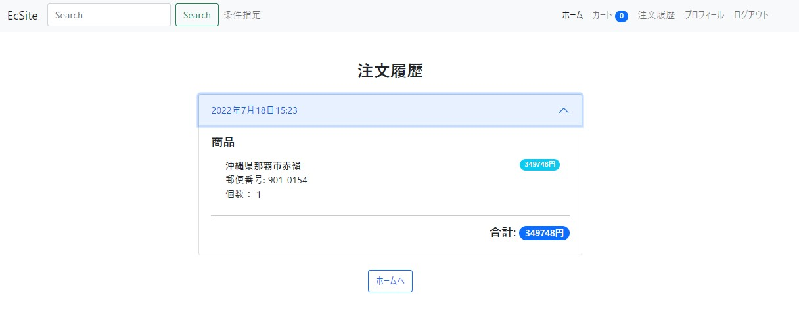

# Features

## 検索機能
このECサイトは検索機能があり、膨大なデータから自分の目的にあったものを容易に見つけることができる。

### 条件指定
「郵便番号」、「都道府県」、「市区町村」、「町域」、「価格」の条件を指定して検索を行うことができる。


headerの条件指定をクリックすると、モーダルが現れ、ここから条件を指定して検索を行うことが可能である。<br>
また、OR検索とAND検索を選べるようになっており、より高度な検索をすることが可能。

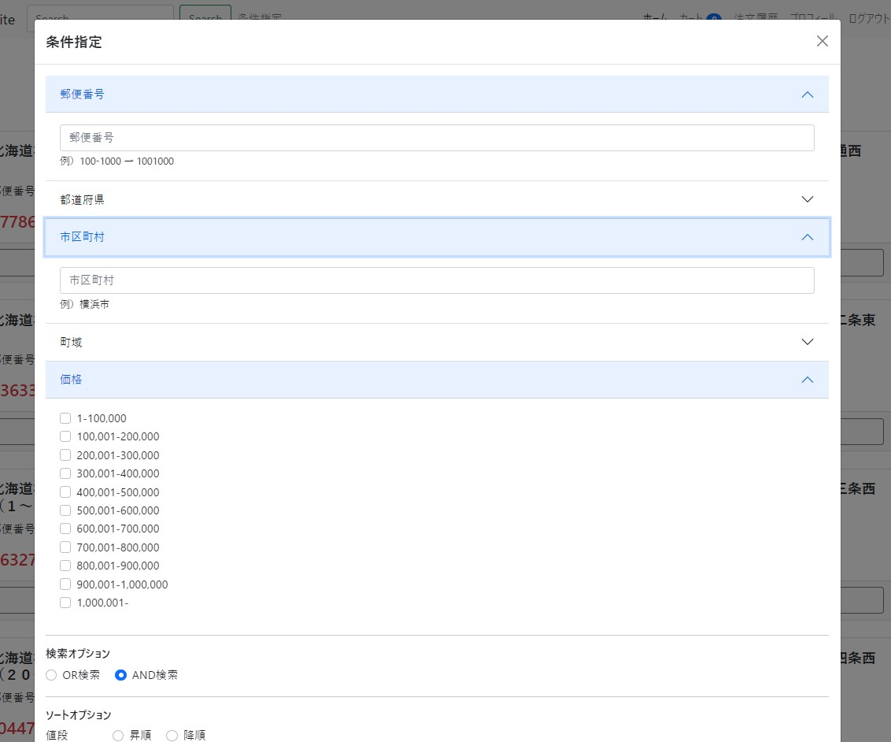

検索結果<br>
その際のURLは↓<br>
`http://localhost:8000/?code=02&prefecture=栃木県&prefecture=埼玉県&prefecture=京都府&prefecture=岡山県&city=&area=横&price=100000&price=1000000&searchOption=and&sortOption=price`

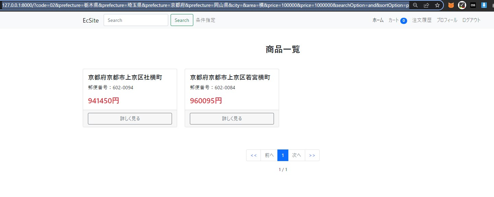

### フリーワード検索

headerの検索欄は、任意の文字列での検索に対応している。（全文検索）<br>
具体的には、商品の「郵便番号」、「都道府県」、「市区町村」、「町域」に、入力した文字列と似た文字列が含まれている商品を表示する。<br>
例えば、「愛」と入力すると、「郵便番号」、「都道府県」、「市区町村」、「町域」のどこかに「愛」を含む商品を検索結果として表示する。

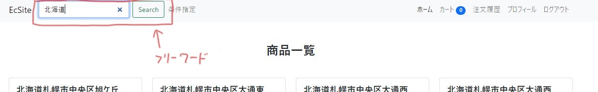

## ソート機能
「値段」、「都道府県」、「市区町村」、「町域」のどれか一つを指定して昇順、降順で並び替えることができる。<br>
条件指定をクリックした際に現れるモーダルで検索結果を並び替えることが可能。

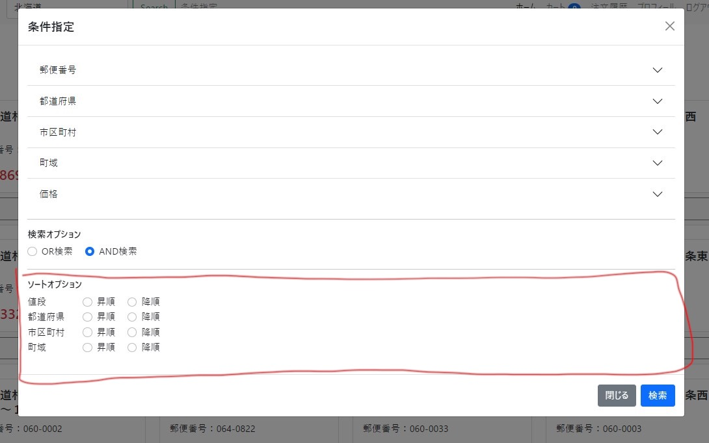

## レスポンシブ対応

このECサイトは、画面幅がスマホサイズになったとしてもデザインが崩れない、レスポンシブなサイトである。<br>
画像に映っているホーム画面だけでなく、全てのページで同様の処理をしている。


# Rquirement

## Language
- Python v3.8.3
- HTML, CSS

## Library
- Django v4.0.5
- Bootstrap v5

## Database
- PostgreSQL
- （SQLite）<br>
  今回は、PostgreSQLをメインに使用しているが、SQLiteも扱えるようにコード内にコメントとして残してある。

# Usage

## Dockerを使う場合

1. Dockerをインストールする

2. コンテナの作成
    ```
    $ docker-compose up -d
    ```

3. サーバの起動
    まずは、pythonのコンテナに接続
    ```
    $ docker exec -it EcSite-python bash
    ```

    そして、サーバを起動
    ```
    $ python manage.py runserver 0.0.0.0:8888
    ```

4. ブラウザで開く

    ```http://localhost:8888```にアクセスする。<br>
    ※管理者ユーザは下記である。<br>
    メールアドレス: `admin@a.com`<br>
    パスワード: `hogehoge`

## Dockerを使わない場合
1. Pythonのインストール<br>
    バージョンは3.8.3で動かしている。

2. 仮想環境の構築
    今回は、venvを用いてPythonの仮想環境の構築を行う。
    ```
    $ python -m venv 220620_EcSite
    ```
    ※「220620_EcSite」は仮想環境の名前であるため、任意のものでも問題ない

3. 仮想環境のアクティベート<br>
    仮想環境をアクティベートする。

    Linux、Macの場合
    ```
    $ source 220620_EcSite/bin/activate
    ```

    Windowsの場合
    ```
    $ .\220620_EcSite\Scripts\activate 
    ```

4. パッケージのインストール<br>
    Djangoなど必要なパッケージをインストールする。
    ```
    $ pip install -r requirements.txt
    ```

5. データベースの準備<br>
    DjangoのデフォルトのデータベースであるSQLiteとPostgreSQLの2つを使用できる。<br>
    EcSiteフォルダの中のsettings.pyの91行目からのコメントを修正して変更する。

    ```
    DATABASES = {
      'default': {
          # ↓ sqlite3で動かす場合 ↓
          # 'ENGINE': 'django.db.backends.sqlite3',
          # 'NAME': BASE_DIR / 'db.sqlite3',

          # ↓ postgresで動かす場合 ↓
          'ENGINE': 'django.db.backends.postgresql_psycopg2',
          'NAME': os.environ['DATABASES_NAME'],
          'USER': os.environ['DATABASES_USER'],
          'PASSWORD': os.environ['DATABASES_PASSWORD'],
          'HOST': os.environ['DATABASES_HOST'],
          'PORT': os.environ['DATABASES_PORT'],
      }
    }
    ```

    - PostgreSQLを使用する場合<br>
        `.env`ファイルを準備する

        ```
        DATABASES_NAME="220620_EcSite"
        DATABASES_USER="ecsiteadmin"
        DATABASES_PASSWORD="hogehoge"
        DATABASES_HOST="localhost"
        DATABASES_PORT=""
        ```

        上記のような.envファイルを準備し、DjangoがPostgreSQLに接続できるようにする。<br>
        ※このプログラムは、サーバー上にアップされていないので、```.env```ファイルをこのgithub上にアップしている。<br>
        また、```.env```ファイルはデフォルトではdocker環境に合わせて構築されている。

6. プログラムの起動<br>
    データベースを構築と、管理者用のサーバーを作成し、開発者用のサーバーを起動する。
    ```
    $ python manage.py makemigrations
    ```
    ```
    $ python manage.py migrate
    ```
    ```
    $ python manage.py createsuperuser
    ```
    ```
    $ python manage.py runserver
    ```

7. 商品データのインポート<br>
    起動したら`http://localhost:8000/admin`にアクセスし、作成した管理者用ユーザーでログインする。<br>
    左側の「商品」をクリックし、インポートを行う。<br>
    インポートには時間がかかる。

    インポートの方法<br>
    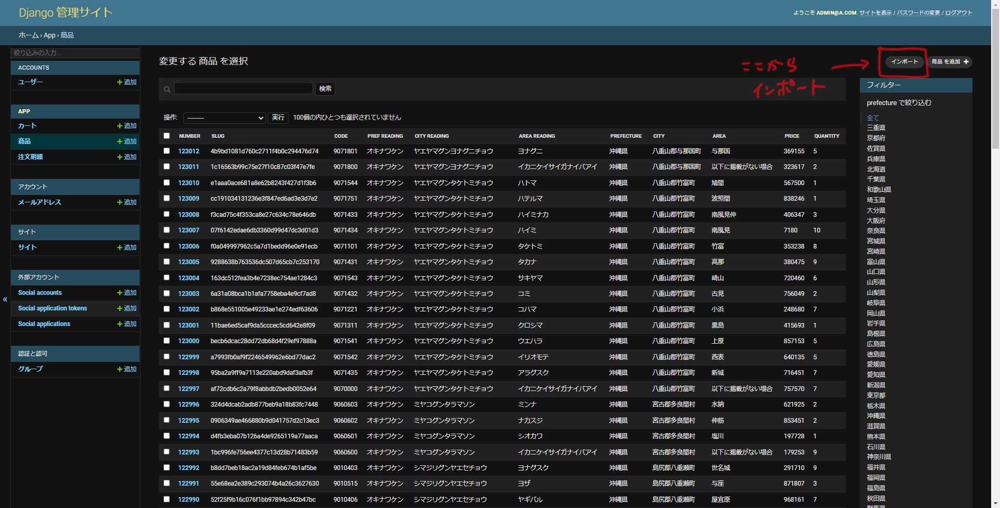
    
    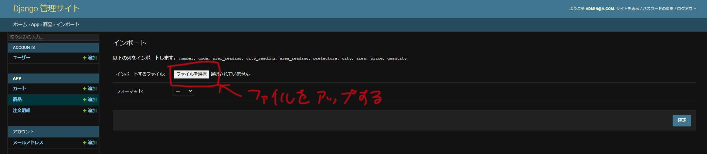

    databaseフォルダ内のpostalcode.csvが住所のデータ。<br>
    ※excelで開くと、郵便番号が数字と扱われて先頭の0が消えるので注意。

    ※```docker/postgres/init/ecsite_dump.sql```はデータベースをダンプしたファイルなので、それを使用することもできる。12万件の商品情報があらかじめインポートされている。<br>
    ダンプされたデータベースを丸ごと使用する場合の管理者ユーザーは、<br>
    メールアドレス: `admin@a.com`<br>
    パスワード: `hogehoge`

# Notes

データベースはdatabaseのフォルダに`db.sqlite3`がありますので、それを使うのが一番早いと思われます。その場合は、settings.pyを修正してください。
